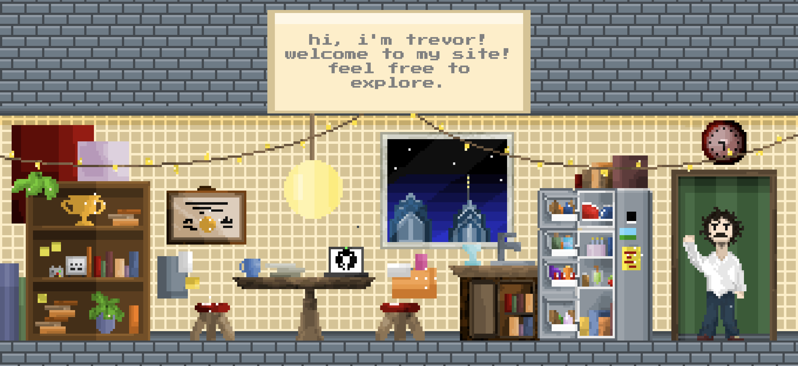

# My Landing Page!

Welcome to the repo for my website!  
I made this to put my projects, skills, and resume together in one place.

I'm exploring the intersections of art and technology, and creating an interactive portfolio seemed like a great place to start!



## Features
- Interactive tooltips (hover over shiny objects to see what they do).
- Fully animated sprites + scene built from scratch.
- Sprite movement; walk around and get familiar with the place!
- Clean/responsive design for (hopefully) easy navigation.
- Includes my **[resume](https://trevorflick.com/assets/Trevor_Flick_Resume.pdf)** and links to projects I've worked on.  
- Deployed with [GitHub Pages](https://pages.github.com) using a custom domain (Yay!).

## Live Site
Visit the live website here: [trevorflick.com](https://trevorflick.com)  
I'll be adding new features as my portfolio continues to grow, so stay tuned!

## Project Structure
root/  
    ├── main.js # JavaScript for interactivity (built using Phaser's 'scene' object, using preload, create, and update functions)  
    ├── index.html # Main HTML structure  
    ├── styles.css # Custom styles  
    └── assets/  
&nbsp;&nbsp;&nbsp;&nbsp;&nbsp;&nbsp;&nbsp;&nbsp;&nbsp;&nbsp;&nbsp;&nbsp;├── resume.pdf  
&nbsp;&nbsp;&nbsp;&nbsp;&nbsp;&nbsp;&nbsp;&nbsp;&nbsp;&nbsp;&nbsp;&nbsp;└── (all of the models).png  


## Technologies Used
- **JavaScript**: For interactivity and tooltips.
- **[Phaser Framework](https://phaser.io/)**: For gamifying (rendering, physics, objects, scene management, input handling). 
- **HTML**: For structuring content.
- **CSS**: For styling and layout.
- **[Piskel](piskel.com)**: For creating the sprites, animations, and background.
- **GitHub Pages**: For hosting and deployment.
- **Custom Domain**: Configured with `trevorflick.com`.

## How to Run Locally

1. Clone this repository:
   ```bash
   git clone https://github.com/trevflick/site.git
2. Navigate to the project directory:
    ```bash 
    cd site 
3. Open **index.html** in your browser to view the site locally.
    - VSCode has live server extenstions (like Live Preview from Microsoft) that can be downloaded to run this very easily
    - if you're not using VSCode I recommend getting node.js since it includes npm:
        - download [node.js](https://nodejs.org/en)
        - install http-server at the root directory of project:
        ```bash
        npm install http-server
    - run the server:
        ```bash
        http-server .
## Future Features
- Add a live day/night mode with different lighting/window views.  
- Add sounds for the tooltips.  
- Add a feature to see other people who are on the site.  
- Include some type of interactive Philly food/restaurant component.  
 &nbsp;&nbsp;&nbsp;&nbsp;&nbsp;&nbsp;(The Google and Yelp APIs are quite pricey! Any cheaper/free alternatives for Philly business details would be appreciated!)

## Contributions
Contributions are always welcome!  

If you'd like to:  
- suggest improvements  
- collaborate on future features  
- report any bugs

1. Fork the repository.  
2. Create a new branch for your changes.  
3. Open a pull request describing the changes.  
4. Send me a [message](me@trevorflick.com) and I'll take a look!